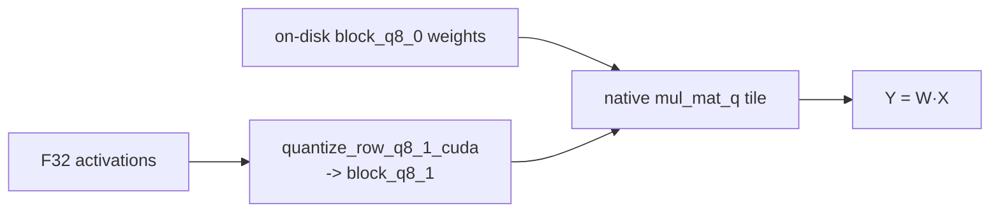
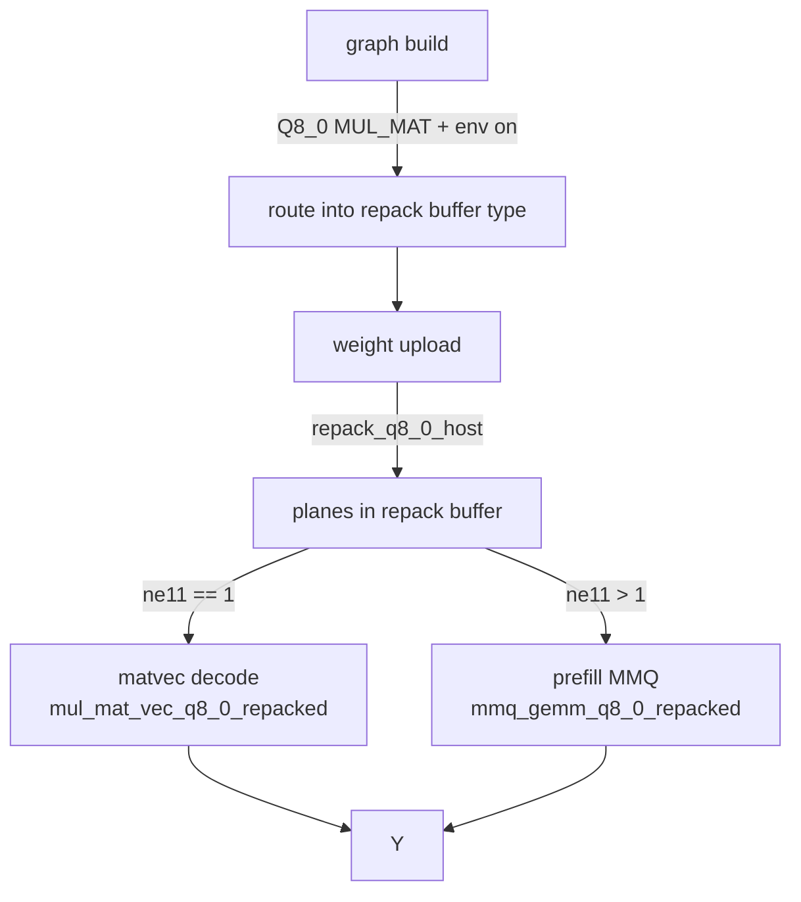

# Repacked vs Standard MMQ — a complete guide (Q8_0, gfx906)

> Scope: this guide explains how the **repacked** Q8_0 matrix-multiply path in
> `ggml/src/ggml-cuda/repack-gcn.cu` differs from the **standard (native)**
> `mul_mat_q<Q8_0>` path, using diagrams and the actual source layout. All
> numbers refer to the Q8_0 quant on a gfx906 (Vega20 / MI50-MI60) device.

---

## 1. TL;DR

| | Standard MMQ | Repacked MMQ |
|---|---|---|
| Weight storage | on-disk `block_q8_0` (qs + scale interleaved) | two **planes**: qs stream + fp16-d stream |
| Tile width (N) | **selected per N** (`mmq_x ∈ {8..128}`) | **fixed** `BN = 128` (one config) |
| Compute paths | native `mul_mat_q` + `mul_mat_vec_q` | `mmq_gemm_q8_0_repacked` (prefill) + `mul_mat_vec_q8_0_repacked` (decode) |
| Opt-in | always on | `GGML_CUDA_REPACK=1` **and** `GGML_CUDA_REPACK_Q8_0=1`, GCN only |
| Small-N (ubatch) | efficient | **regresses** (wasted tile) |
| Large-N (ubatch) | efficient | **wins ~+10%** (better tiling/threading) |

The repacked planes are **byte-identical to on-disk `block_q8_0` modulo row
padding**, so the win is *purely* in tiling/threading/coalescing of the GEMM —
not in compression.

---

## 2. Background: what MMQ is

A quantized `MUL_MAT` computes `Y = W · X` where `W` is a Q8_0 weight matrix
(`[M=ne01 rows, K=ne00 cols]`) and `X` is an F32 activation (`[K, N=ne11]`).
For prefill (`N > 1`) the kernel is an **MMQ** (mixed-matrix-multiply, tile
GEMM); for decode (`N == 1`) it is a **matvec** (one activation column).

Q8_0 stores weights in **32-weight sub-blocks**. One sub-block = 32 int8
values + one fp16 scale `d` = **34 bytes**. A tile GEMM streams these in
fixed-size tiles across the GPU.

---

## 3. Standard (native) path

### 3.1 On-disk `block_q8_0` layout

```
block_q8_0  (34 bytes, one 32-weight sub-block)
┌───────────────────────────────┬────────┐
│  qs[0..31]  (32 × int8 = 32 B) │  d fp16 │   (= 2 B)
└───────────────────────────────┴────────┘
        weights           scale
```

Weights and scales live **interleaved** in the superblock; reading one sub-block
needs a 2-byte scale fetch alongside the 32-byte weight fetch.

### 3.2 Native data flow



The native kernel **chooses its tile width per N** (`mmq.cuh::mul_mat_q_case`
picks `mmq_x ∈ {8,16,…,128}`, capped at 64 for N<4096 on gfx906). This is the
key property repack *loses*:

```
N (ubatch)   native tile width (mmq_x)     efficiency
───────────  ────────────────────────────  ──────────
   128             64 (capped)              high
   512             64 (capped)              high
  2048            128                        high
```

Because the tile always matches N, native stays efficient at **every** ubatch.

---

## 4. Repack path

### 4.1 Why repack?

On gfx906 (wave64), the on-disk interleaved layout only sustains ~58% of HBM
bandwidth for the matvec because nibbles/scales interleave every few bytes.
Repack rewrites weights, **once at upload**, into **planes** the GEMM can stream
fully coalesced (the Q8_0 MMQ sustains ~89% bandwidth on a 21504×5376 FFN
shape). The Q8_0 case is special: the planes are byte-identical to on-disk
`block_q8_0`, so there is **no bandwidth gain from repacking itself** — the win
is entirely in the GEMM **tiling/threading** (fixed wide tile + LDS staging).

### 4.2 Repacked Q8_0 plane layout

```
repacked Q8_0  (per row of K weights, nsp = K/32 sub-blocks, +1 if K/32 is pow2)

 qs plane :  nsp × 32 B   ── one 32-byte chunk per sub-block, consecutive → coalesced
 d  plane :  nsp ×  2 B   ── fp16 scale per sub-block, separate stream
            ─────────────────────────────────────────────────────────────
            total = nsp × 34 B  (== on-disk size modulo row-stride padding)
```

A wave of 64 lanes reads 64 consecutive 32-byte chunks in one coalesced sweep —
no scale/weight interleave stalls.

### 4.3 Lifecycle (GATE → REPCK → COMPUTE)



- **GATE**: `ggml-backend-meta.cpp` routes a supported MUL_MAT into the repack
  `buft` when `GGML_CUDA_REPACK=1` and `GGML_CUDA_REPACK_Q8_0=1` and the device
  is GCN.
- **REPCK**: `ggml_backend_cuda_repack_buffer_set_tensor` calls
  `repack_q8_0_host` once at upload; the repacked tensor **cannot be read back**
  (`get_tensor` aborts).
- **COMPUTE**: the kernels read the planes directly.

### 4.4 Compute-path decision

```
                 src0 in repack buffer type?
                          │
              ne11 (N) == 1 ?
             ┌────────────┴────────────┐
            yes                       no
             │                         │
   mul_mat_vec_q8_0_repacked   mmq_gemm_q8_0_repacked
   (dp4a matvec, decode)        (int8 MMQ tile GEMM, prefill)
```

For MoE, `ggml_cuda_mul_mat_id_repacked` adds a grouped-tile GEMM over
expert-sorted assignments (decode = one matvec per assignment; batch = thin
16-token tiles).

### 4.5 The fixed Q8_0 MMQ tile

The repacked prefill GEMM uses **one fixed tile** (see `repack-gcn.cu`):

```
#define MMQ_RP_Q8_BK 4      // K sub-blocks per LDS fill
#define MMQ_RP_Q8_TN 2      // token tiles per lane (prefill)
#define MMQ_RP_Q8_BM 64     // weight rows per block (base)
#define MMQ_RP_Q8_BN 128    // = 64 × TN  (token cols per block)
#define MMQ_RP_Q8_NROW_LANES 4
```

- 512-thread block (`64×8` wavefront grid), 8 row lanes × 16 rows/lane → BM=128
  nominal; weights staged through LDS and read per-row in the K-loop (transient
  staging keeps VGPRs ~36 so 8 waves fit gfx906's 65K VGPR/CU).
- The activation is read from the transposed `block_q8_1_mmq` buffer via
  `rp_xq_from_mmq` (produced by `quantize_mmq_q8_1_cuda`).
- **It never selects the tile by N.** That is the whole limitation.

---

## 5. Side-by-side: where the bytes go

```
STANDARD (native) MMQ                       REPACKED MMQ
─────────────────────────                   ───────────────────────────────
weights: block_q8_0 (interleaved)          weights: qs plane (32B) + d plane (2B)
  read: 34B/sub-block, scale every fetch     read: 32B qs coalesced, d separate
activation: block_q8_1 (canonical)         activation: block_q8_1_mmq (transposed)
tile width: mmq_x chosen per N             tile width: BN=128 FIXED
K-loop:    native tiling + LDS             K-loop: BK=4 LDS stage, hoisted r-loop
result:     efficient at all N             result: wins large N, loses small N
```

---

## 6. Performance reality (A/B, `pp2048`, Qwen3.5-4B Q8_0, gfx906)

| ubatch (N) | native t/s | repack t/s | repack vs native |
|---:|---:|---:|---:|
| 16  | 345.0 | 161.0 | **−53%** |
| 32  | 511.1 | 300.7 | **−41%** |
| 64  | 689.4 | 544.6 | −21% |
| 128 | 972.5 | 874.9 | −10% |
| 256 | 1240.7 | 1169.8 | −6% |
| 512 | 1307.8 | 1314.5 | +0.5% |
| 1024 | 1291.2 | 1401.8 | **+8.6%** |
| 2048 | 1258.1 | 1390.0 | **+10.5%** |

```
repack advantage vs N
  ubatch
   16  ████████████████  -53%
   64  ████████          -21%
  128  ████              -10%
  256  ██                -6%
  512  ▏                 +0.5%   <-- crossover
 1024  ██                +8.6%
 2048  ████              +10.5%
```

The crossover is at **ubatch ≈ 512**. Native's per-N tile choice is exactly what
repack lacks:

```
native:   N=128 → narrow tile  → full
          N=2048→ wide  tile   → full
repack:   N=128 → 128-wide tile, half empty → WASTED
          N=2048→ 128-wide tile, full        → WINS
```

---

## 7. Cost / caveats

- **Read-back forbidden.** Repacked tensors cannot be retrieved
  (`ggml_backend_cuda_repack_buffer_get_tensor` aborts) — matters for
  quantize/save from a loaded model; opt out with `GGML_CUDA_REPACK=0`.
- **Decode (matvec) loses ~6%** to canonical `mmvq`, so end-to-end (pp+tg) wins
  are smaller than prefill alone suggests.
- **Small-N regression** (up to −53%) makes repack a net loss for short prompts
  / small batches.
- **Fixed tile** is the core design limit; making it N-selectable is the key
  outstanding work item (see `repack_tuning.md`).

---

## 8. Source map

| Concern | Location |
|---|---|
| Repack buffer type, opt-in | `repack-gcn.cuh`, `repack-gcn.cu` (`ggml_backend_cuda_repack_buffer_type`, `ggml_cuda_repack_tensor_supported`) |
| Host repack (planes) | `repack_q8_0_host` |
| Decode matvec | `mul_mat_vec_q8_0_repacked` |
| Prefill MMQ | `mmq_gemm_q8_0_repacked`, `MMQ_RP_Q8_*` macros |
| Dispatch | `ggml_cuda_mul_mat_repacked` / `_slice`, `ggml_cuda_mul_mat_id_repacked` |
| Native tile selection | `mmq.cuh::mul_mat_q_case` |
| Tuning & sweep correctness | `repack_tuning.md` |
| Peak-optimization proposals | `repack_peak_optimization.md` |
